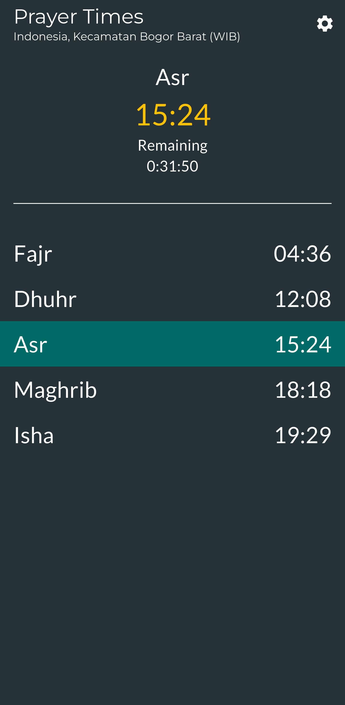
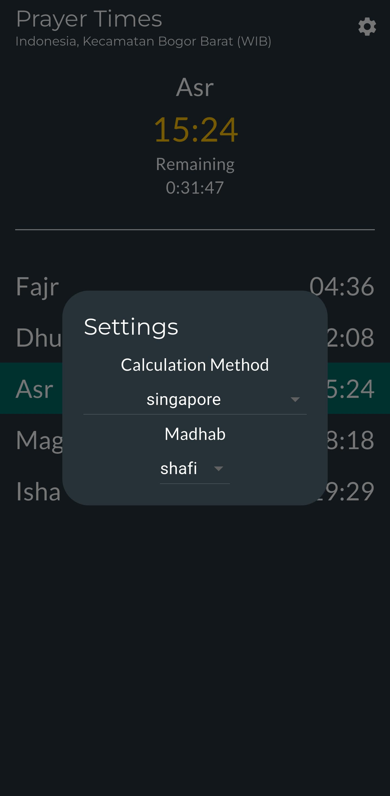

<h1 align="center">Syamsun&nbsp;&nbsp;
    
</h1>

**Syamsun** is a Flutter-based application that helps users keep track of Islamic prayer times. The app provides accurate prayer times based on the user's location, displays the remaining time until the next prayer, and sends notifications to remind users of upcoming prayers.

## Table of Contents
- [Table of Contents](#table-of-contents)
- [Screenshots](#screenshots)
  - [Home Widgets](#home-widgets)
- [Problems](#problems)
- [To-Do-List](#to-do-list)
- [Dependencies](#dependencies)
- [My Environment Detail](#my-environment-detail)
- [Setup](#setup)

## Screenshots
<table>
    <tbody>
        <tr>
            <td></td>
            <td></td>
        </tr>
    </tbody>
</table>

### Home Widgets

<table>
    <tbody>
            <td></td>
    </tbody>
</table>


## Problems 

These problems may be fixed in the future, because i still learning Flutter at the moment. Here is the list of problems

1. The dropdown menu item for calculation method and madhab doesn't looks good (has an underscore, lowercase, etc)
2. The app haven't been tested on several mobile phone
3. Size and performance issue?
4. You can't set the other timezone other than your smartphone has
5. There is no way to change the location (Automatically picked based on your location)

## To-Do-List

I only do these thing if user really request me to do this. For now i'll just put it here
1. Make light theme (Are you guys even interested?) and dark theme mode
2. Make the home widgets available for Apple user

## Dependencies

- google_fonts
- adhan
- flutter_local_notifications
- geocoding
- geolocator
- google_fonts
- home_widget
- intl
- permission_handler
- shared_preferences
- timezone

## My Environment Detail

- Flutter SDK (3.27.1)
- Gradle: 8.3
- Kotlin : 1.9.0
- Groovy : 3.0.17
- Ant : Apache Ant(TM) version 1.10.13 compiled on January 4 2023
- JVM : 23.0.2 (Ubuntu 23.0.2+7-Ubuntu-1ubuntu122.04)
- OS : Linux 6.8.0-52-generic amd64


## Setup

1. **Prequisite**
    - Install Java JDK 11 or higher
    - Set JAVA_HOME environment variable
    - Install Android Studio or Android SDK
    - Set ANDROID_HOME environment variable
    - 

2. **Download or Clone Project**
   - To download, click on the "Code" button, then select "Download ZIP".
   - To clone, use the following Git command: 
   ```
   git clone https://github.com/insanansharyrasul/syamsun.git
   ```

3. **Run the Flutter App on android**
    1. Run 
    ```
    flutter build apk
    ```
    2. On the `./build/outputs/apk/debug/` exist the `.apk` file so it can be installed to your smartphone
